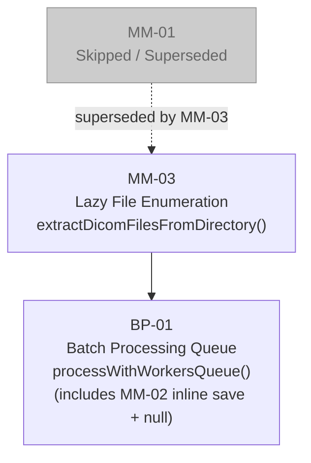

# dicom_deid — P0 Memory Management Patches

## Overview

These patches fix two root causes of out-of-memory crashes in the `dicom_deid` browser tool when processing large folder-mode datasets (e.g. 30 CTC studies, ~42 GB).

**MM-03** eliminates the eager full-file read during directory enumeration — previously, every DICOM file's entire `ArrayBuffer` was loaded into RAM just to check the magic bytes. The fix reads only the 132-byte DICOM header for the check, storing only the `FileSystemFileHandle` for later lazy loading.

**BP-01** (which subsumes **MM-02**) replaces the unbounded streaming dispatch with a queue-based batch processor. Workers pull batches of at most `BATCH_SIZE` files at a time; file data is read from the handle immediately before dispatch, transferred zero-copy to the worker, and the result `ArrayBuffer` is nulled immediately after saving to disk. At peak, only `workerCount × BATCH_SIZE` files are in RAM simultaneously.

**MM-01 is skipped** — it was superseded by MM-03 (lazy enumeration makes the MM-01 chunking approach unnecessary).

Both patches touch only `main.js`. `dicom-worker.js` is unchanged.

---

## Dependency Order



Apply **MM-03 first**, then **BP-01**. MM-01 requires no action.

---

## Patch 1 of 2: MM-03 — Lazy File Enumeration

**File**: `main.js`

**Problem**: `extractDicomFilesFromDirectory()` reads the full `ArrayBuffer` of every file in the directory tree just to check the DICOM magic bytes. For a 42 GB folder this loads the entire dataset into RAM before a single file is processed.

**Fix**: Read only the first 132 bytes (the DICOM preamble + magic) for the header check. Store only the `FileSystemFileHandle` in the `dicomFiles` array — the full file data is loaded lazily at dispatch time in `processWithWorkersQueue()`.

### Remove this code

```javascript
        async function processDirectory(directoryHandle, relativePath = '') {
            console.log(`Processing directory: ${relativePath || 'root'}`);
            
            for await (const [name, handle] of directoryHandle.entries()) {
                const currentPath = relativePath ? `${relativePath}/${name}` : name;
                
                if (handle.kind === 'directory') {
                    console.log(`Found subdirectory: ${currentPath}`);
                    await processDirectory(handle, currentPath);
                } else if (handle.kind === 'file') {
                    filesChecked++;
                    // Checking file
                    
                    try {
                        const file = await handle.getFile();
                        const arrayBuffer = await file.arrayBuffer();
                        
                        if (self.isDicomFile(arrayBuffer)) {
                            dicomFilesFound++;
                            // DICOM file found
                            dicomFiles.push({
                                filename: currentPath,
                                data: arrayBuffer,
                                path: currentPath,
                                fileHandle: handle
                            });
                            
                            // Update progress with live count
                            self.updateProgress(`Listing Files ... (${dicomFilesFound} DICOM files found)`, 5 + (filesChecked * 10 / Math.max(filesChecked, 100)));
                        }
                    } catch (error) {
                        console.warn(`Error reading file ${currentPath}:`, error);
                    }
                }
            }
        }
```

### Replace with this code

```javascript
        async function processDirectory(directoryHandle, relativePath = '') {
            console.log(`Processing directory: ${relativePath || 'root'}`);
            
            for await (const [name, handle] of directoryHandle.entries()) {
                const currentPath = relativePath ? `${relativePath}/${name}` : name;
                
                if (handle.kind === 'directory') {
                    console.log(`Found subdirectory: ${currentPath}`);
                    await processDirectory(handle, currentPath);
                } else if (handle.kind === 'file') {
                    filesChecked++;
                    
                    try {
                        // MM-03: Read only 132-byte header to check DICOM magic bytes.
                        // Do NOT read the full file — that would load the entire dataset into RAM.
                        const file = await handle.getFile();
                        const headerSlice = await file.slice(0, 132).arrayBuffer();
                        
                        if (self.isDicomFile(headerSlice)) {
                            dicomFilesFound++;
                            // Store only the file handle — data will be read lazily at dispatch time
                            dicomFiles.push({
                                filename: currentPath,
                                path: currentPath,
                                fileHandle: handle
                                // NOTE: no 'data' field — loaded lazily in processWithWorkersQueue()
                            });
                            
                            // Update progress with live count
                            self.updateProgress(`Listing Files ... (${dicomFilesFound} DICOM files found)`, 5 + (filesChecked * 10 / Math.max(filesChecked, 100)));
                        }
                    } catch (error) {
                        console.warn(`Error reading file ${currentPath}:`, error);
                    }
                }
            }
        }
```

---

## Patch 2 of 2: BP-01 — Batch Processing Queue (includes MM-02)

**File**: `main.js`

**Problem**: `processWithWorkersStreaming()` distributes all files across workers upfront via `distributeFiles()`, meaning every file's `ArrayBuffer` is in RAM simultaneously. For large datasets this exhausts the browser's memory limit. Additionally, result `ArrayBuffer`s are retained in `this.results` long after saving, compounding the leak (MM-02).

**Fix**: Replace folder-mode dispatch with `processWithWorkersQueue()` — a queue-based loop where each worker pulls batches of `BATCH_SIZE` files, reads their data lazily from `FileSystemFileHandle` just before posting, transfers the buffers zero-copy to the worker, then nulls `result.data` immediately after saving to disk. Peak RAM is bounded to `workerCount × BATCH_SIZE` files at any time.

### Change A: Add constants to constructor

**Find** (in constructor, after `this.verboseLogs = [];`):

```javascript
        this.completedWorkers = 0;
```

**Replace with**:

```javascript
        this.completedWorkers = 0;
        
        // Memory management: max files per worker batch and max total in-flight
        this.BATCH_SIZE = 50;   // files per worker batch dispatch
```

---

### Change B: Add new `processWithWorkersQueue()` method

This is a **new method** — add it directly after the closing `}` of the existing `processWithWorkersStreaming()` method. No existing code is removed.

```javascript
    /**
     * BP-01: Queue-based batch processing for folder mode.
     * Replaces processWithWorkersStreaming() for folder mode.
     *
     * Memory profile: at most (workerCount × BATCH_SIZE) files in RAM at any time.
     * File data is read lazily from fileHandle just before dispatch, and transferred
     * to the worker (zero-copy). After the worker completes, result.data is nulled
     * immediately after saving to disk (MM-02).
     */
    async processWithWorkersQueue(dicomFiles) {
        const BATCH_SIZE = this.BATCH_SIZE;
        let cursor = 0;
        const totalFiles = dicomFiles.length;
        
        // Lazily read file data from handle just before dispatch
        const readFileData = async (fileDescriptor) => {
            const file = await fileDescriptor.fileHandle.getFile();
            const data = await file.arrayBuffer();
            return {
                filename: fileDescriptor.filename,
                path: fileDescriptor.path,
                data: data
            };
        };
        
        // Prepare next batch: read data for up to BATCH_SIZE files
        const prepareNextBatch = async () => {
            if (cursor >= totalFiles) return null;
            const end = Math.min(cursor + BATCH_SIZE, totalFiles);
            const batchDescriptors = dicomFiles.slice(cursor, end);
            cursor = end;
            // Read file data for this batch (only these files are in RAM now)
            const batch = await Promise.all(batchDescriptors.map(readFileData));
            return batch;
        };
        
        // Dispatch a batch to a worker and wait for completion
        const dispatchBatch = (worker, batch, workerIndex) => {
            return new Promise((resolve, reject) => {
                const handler = async (e) => {
                    if (e.data.type !== 'COMPLETE') return;
                    worker.removeEventListener('message', handler);
                    worker.removeEventListener('error', errHandler);
                    
                    const { results, auditTrail, verboseLogs, errorLog, skippedFiles } = e.data;
                    
                    // MM-02: Save to disk immediately, then null out data to free RAM
                    for (const result of (results || [])) {
                        if (result.success && result.data) {
                            try {
                                await this.saveProcessedFile(result);
                            } catch (saveErr) {
                                console.error('Error saving file:', result.filename, saveErr);
                                result.success = false;
                                result.error = saveErr.message;
                            }
                            result.data = null; // Release ArrayBuffer immediately
                        }
                        // Keep only lightweight metadata — no binary data
                        this.results.push({
                            filename: result.filename,
                            success: result.success,
                            error: result.error || null
                        });
                        
                        // Update progress counter
                        this.processedFiles++;
                        const pct = 20 + (this.processedFiles / this.totalFiles) * 70;
                        this.updateProgress(`Processed ${this.processedFiles} / ${this.totalFiles} files`, pct);
                    }
                    
                    // Collect audit trails (lightweight — no binary data)
                    if (auditTrail) {
                        this.auditTrails.push(...auditTrail);
                    }
                    
                    // Collect verbose logs if enabled
                    if (verboseLogs && verboseLogs.length > 0) {
                        this.verboseLogs.push(...verboseLogs);
                    }
                    
                    // Collect error logs
                    if (errorLog) {
                        this.errorLogs.push(errorLog);
                    }
                    
                    // Track skipped files
                    if (skippedFiles) {
                        this.skippedFiles = (this.skippedFiles || 0) + skippedFiles;
                    }
                    
                    resolve();
                };
                
                const errHandler = (err) => {
                    worker.removeEventListener('message', handler);
                    worker.removeEventListener('error', errHandler);
                    reject(err);
                };
                
                worker.addEventListener('message', handler);
                worker.addEventListener('error', errHandler);
                
                // Transfer ArrayBuffers to worker (zero-copy move — main thread loses reference)
                const transferables = batch
                    .map(f => f.data)
                    .filter(d => d instanceof ArrayBuffer);
                
                worker.postMessage({
                    type: 'PROCESS_CHUNK',
                    files: batch,
                    passphrase: this.passphrase,
                    workerId: workerIndex,
                    allowedSOPClassUIDs: this.allowedSOPClassUIDs,
                    tagConfigurations: this.tagConfigurations,
                    verboseMode: this.verboseMode
                }, transferables);
            });
        };
        
        // Each worker runs a loop: pull next batch → dispatch → wait → repeat
        const runWorker = async (worker, workerIndex) => {
            while (true) {
                const batch = await prepareNextBatch();
                if (!batch) break; // No more files
                await dispatchBatch(worker, batch, workerIndex);
                // After dispatchBatch resolves: batch ArrayBuffers have been transferred
                // to the worker (and are now null on main thread), and result.data has
                // been nulled after saving. Memory is free.
            }
        };
        
        // Run all workers concurrently; each pulls batches sequentially from the shared queue
        await Promise.all(this.workers.map((worker, i) => runWorker(worker, i)));
        
        // All workers done — finalize
        await this.finalizeStreamingResults();
    }
```

---

### Change C: Update `processFiles()` to call new method

**Find** (in `processFiles()`):

```javascript
            if (this.processingMode === 'zip') {
                this.processWithWorkers(fileChunks);
            } else {
                console.log('Calling processWithWorkersStreaming...');
                await this.processWithWorkersStreaming(fileChunks);
                console.log('processWithWorkersStreaming completed.');
            }
```

**Replace with**:

```javascript
            if (this.processingMode === 'zip') {
                this.processWithWorkers(fileChunks);
            } else {
                console.log('Calling processWithWorkersQueue (BP-01 batch queue)...');
                await this.processWithWorkersQueue(dicomFiles);
                console.log('processWithWorkersQueue completed.');
            }
```

> **Note**: `dicomFiles` is already in scope at this point in `processFiles()`. The `fileChunks` variable and `distributeFiles()` call are no longer used for folder mode but can remain in place — they are still needed for ZIP mode.

---

### Change D: Update `processWithWorkersStreaming()` COMPLETE handler (MM-02)

This change is a **belt-and-suspenders** fix to the old streaming method. Although folder mode no longer calls `processWithWorkersStreaming()`, applying this change ensures the method is safe if it is ever invoked directly (e.g. during debugging or future refactoring).

**Find** (inside the `COMPLETE` message handler in `processWithWorkersStreaming()`):

```javascript
                    for (const result of (results || [])) {
                        if (result.success && result.data) {
                            await this.saveProcessedFile(result);
                        }
                        this.results.push(result);
```

**Replace with**:

```javascript
                    for (const result of (results || [])) {
                        if (result.success && result.data) {
                            await this.saveProcessedFile(result);
                            result.data = null; // MM-02: release ArrayBuffer after save
                        }
                        this.results.push({
                            filename: result.filename,
                            success: result.success,
                            error: result.error || null
                        });
```

---

## No changes to `dicom-worker.js`

The worker already receives a `PROCESS_CHUNK` message, processes the files, and posts a `COMPLETE` message back with results. The new `processWithWorkersQueue()` method uses the same message protocol — it simply controls *when* and *how many* files are sent per message. No worker-side changes are required.

---

## Testing Checklist

- [ ] Folder mode: 4 CTC studies (`1.63 GB`) — should complete without crash
- [ ] Folder mode: 30 CTC studies (`42 GB` folder) — should complete without crash
- [ ] ZIP mode: unchanged behaviour (`distributeFiles` still used, `processWithWorkers` still called)
- [ ] Audit CSV generated correctly for both modes
- [ ] `output.log` generated correctly for both modes
- [ ] Memory stays below `~500 MB` during processing (check Chrome Task Manager → Memory column)
- [ ] Progress bar updates correctly throughout folder-mode processing
- [ ] Skipped files count is accurate in the summary
- [ ] Verbose log output is correct when verbose mode is enabled
